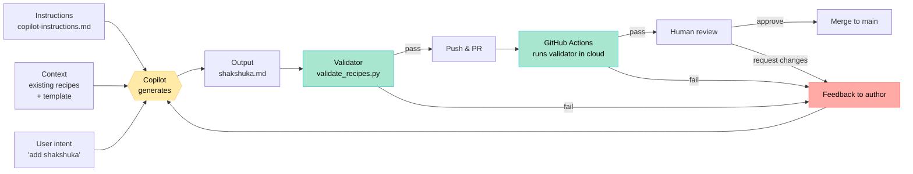

# What This Repo Has To Do With AI Agents

## The hidden subject of this brown bag

This started as a recipe collection. It also happens to be a complete, miniature **AI agent harness**.

If you take one thing away from the session, take this:

> When people talk about "AI agents," the model is the easy part. The **harness** — the structure of instructions, context, generation, validation, and feedback around the model — is the engineering work. And we already know how to build harnesses. We've been building them for code reviews and CI for twenty years.

This document maps what you saw in the demo to the concepts that come up in agent engineering, so you can take the analogy back to your own work.

---

## What is a harness?

In agent engineering, the **harness** (sometimes called "scaffolding") is everything around the language model that turns raw text-generation into useful, trustworthy work:

- The instructions and persona the model operates under
- The context (examples, documents, prior turns) it can see
- The tools it can call (filesystem, shell, APIs)
- The output format it must produce
- The validators that check its output
- The feedback loop that tells it whether it succeeded

A weak model in a strong harness often outperforms a strong model in a weak one. The harness is where most of the engineering leverage lives.

---

## The harness in this repo

Every box maps to something in agent engineering.

---

## The mapping

| What you saw in the demo | What it's called in agent engineering |
|---|---|
| `copilot-instructions.md` | **System prompt** — persistent instructions the model follows |
| Existing recipe files Copilot reads from neighboring tabs | **In-context examples** / few-shot grounding |
| `templates/recipe-template.md` | **Output schema** — structured format the output must follow |
| User typing `# Shakshuka` and pausing | **User intent / task specification** |
| Copilot generating ghost text | **Model inference step** |
| `validate_recipes.py` | **Output validator** — programmatic check on generation quality |
| Validator's error messages | **Tool feedback** — signal the model (or human) can act on |
| Re-generating after a failed check | **Iterative refinement loop** |
| GitHub Actions running validator on push | **CI-style automated evaluation** |
| PR review by a human | **Human-in-the-loop** |
| Failed CI blocking merge | **Guardrail / refusal mechanism** |

If you've built a CI pipeline, you've already built 70% of an agent harness. You just didn't know it yet.

---

## Why this matters for production AI systems

Three principles that the recipe demo accidentally illustrates:

### 1. Validators beat trust

You don't trust Copilot to follow the format. You let it try, then you check programmatically. In production agents, **never rely on the model to police itself**. Always have an external check — schema validation, type checks, test runs, output classifiers, whatever fits the task.

### 2. Context is the highest-leverage variable

The biggest improvement in suggestion quality came from having other recipe files open in tabs and dropping in `copilot-instructions.md`. The model didn't change. The harness around it did.

In production agent work, when output quality is bad, the first place to look is almost never the model. It's: *what context is the model actually seeing? what examples? what instructions? what tools?*

### 3. Feedback loops compound

A validator that runs once is a check. A validator that runs *every time* in CI becomes part of the system's identity — it shapes what gets written in the first place, because contributors learn the format the validator expects. Your harness teaches its users.

This is exactly why production agent systems put serious engineering into evaluations and feedback signals. They're not just measuring quality — they're shaping the system's future behavior.

---

## A checklist for your own harnesses

When you're designing an AI-powered workflow at work, ask these questions in order. They map directly to what you saw in the demo.

1. **Instructions** — Is there a persistent, version-controlled document telling the model what conventions to follow?
2. **Context** — Does the model see relevant examples and reference material, or is it generating in a vacuum?
3. **Schema** — Is the expected output format explicit and machine-checkable?
4. **Validation** — Is there a programmatic check on the output that runs *before* the result is trusted?
5. **Feedback** — When validation fails, does the failure produce a clear, actionable signal for the next iteration?
6. **Automation** — Does the validation run automatically on every change, not just when someone remembers?
7. **Human review** — Is there a checkpoint where a human can override or approve, especially for irreversible actions?
8. **Logging** — Can you reconstruct what the model saw, generated, and was told afterward? (Not shown in the demo, but essential in production.)

If you can answer "yes" to most of these, you have a real harness. If most are "no," you have a model with a prompt — which is fine for prototypes but doesn't scale.

---

## Further reading

- Anthropic's writing on agentic systems and tool use
- The concept of "evals" in LLM development — the rigorous version of the validator pattern
- Constitutional AI and self-critique loops — feedback patterns one level deeper than validators
- ReAct and reflexion patterns — formalized iteration loops

---

## The takeaway

You came here to learn about Git, GitHub, Copilot, and Markdown.

You also just learned the architecture of every well-built AI agent system you'll encounter for the next decade.

The skills transfer. The vocabulary transfers. The instinct to build verification around generation transfers.

That's the actual point of the brown bag.
